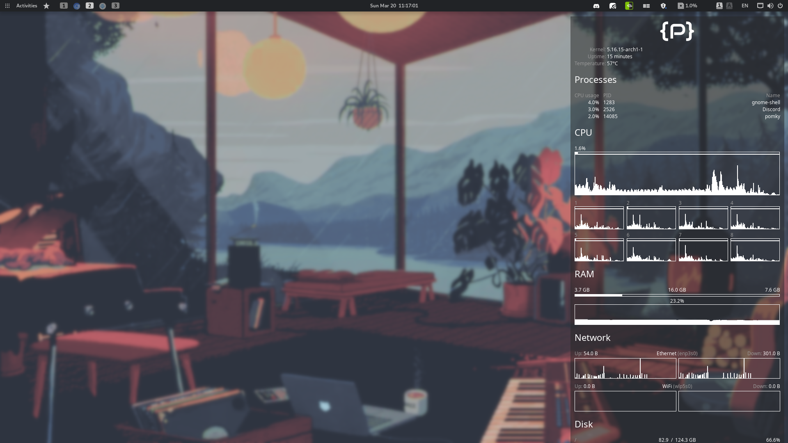

# pompup


[](./LICENSE)

<div align=center>
pompup is a personal one-click Arch Linux desktop setup utility tailor made for myself.

<br />

<!-- space characters used in buttons below are em space instead of regular spaces -->

**[<kbd> <br /> Gallery <br /> </kbd>][Gallery]**
**[<kbd> <br /> Hardware <br /> </kbd>][Hardware]**



---

</div>

|                 Software | Choice                                                                                                              |
| -----------------------: | :------------------------------------------------------------------------------------------------------------------ |
| Desktop Environment - 🚀 | [GNOME](https://www.gnome.org) (to be replaced with [COSMIC](https://github.com/pop-os/cosmic-epoch))               |
|               Icons - 💎 | [Papirus](https://github.com/PapirusDevelopmentTeam/papirus-icon-theme)                                             |
|           GTK theme - 🎨 | [Pop!](https://github.com/pop-os/gtk-theme)                                                                         |
|               Shell - 🐚 | [zsh](https://github.com/zsh-users/zsh) with [ohmyzsh](https://github.com/ohmyzsh/ohmyzsh)                          |
|            Terminal - 🖥️ | [kitty](https://github.com/kovidgoyal/kitty)                                                                        |
|             Browser - 🌐 | [Brave](https://github.com/brave/brave-browser)                                                                     |
|   Text Editor & IDE - 📝 | [VSCodium](https://github.com/VSCodium/vscodium) (to be replaced with [zed](https://github.com/zed-industries/zed)) |

## Name?

The project's name was inspired by [rustup](https://github.com/rust-lang/rustup),
a toolchain installer for the Rust programming language. Pompup was originally
supposed to be written in Rust. I later decided to use Go instead, but the name
stuck.

## Usage

I can't think of any valid use cases of this software outside my computer,
but here are the instructions to use it:

1. Install base Arch Linux
   - https://wiki.archlinux.org/title/installation_guide
2. Create a non-root user and log in
   - give sudo permission
   - create home directory
   - must not contain space in username
3. Download pompup

   - using curl

   ```
   curl pompup.developomp.com -Lo pompup
   ```

   - using wget

   ```
   wget pompup.developomp.com -O pompup
   ```

4. Run pompup

   ```
   ./pompup
   ```

[Gallery]: ./docs/gallery.md
[Hardware]: ./docs/hardware/README.md
