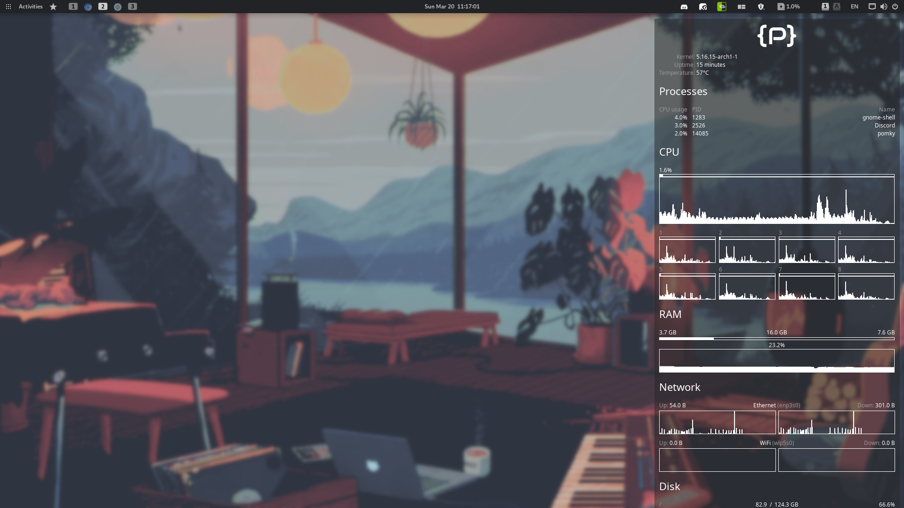

# Gallery

## No windows

## Some windows (with tiling enabled)

## Minimalism at its finest

## Sources

### Wallpaper

- source
  - [a video](https://www.youtube.com/watch?v=QEWV6fiYaDU) from [Chillhop Music](https://www.youtube.com/channel/UCOxqgCwgOqC2lMqC5PYz_Dg)
  - Artwork by [Jeff Östberg](https://jeffostberg.se)
  - Animation by [Geneviève Delacroix](http://www.genevievelacroix.com)
  - Applied Effects (in order)
    - ImageGoNerd - [nordified](https://github.com/Schrodinger-Hat/ImageGoNord) (filtering option toggled)
    - GIMP - gaussian blur 3.5
    - GIMP - level 1 compression
