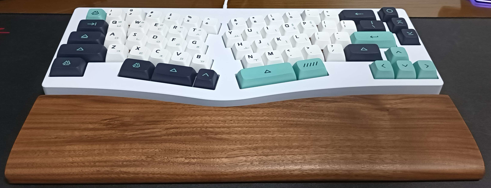
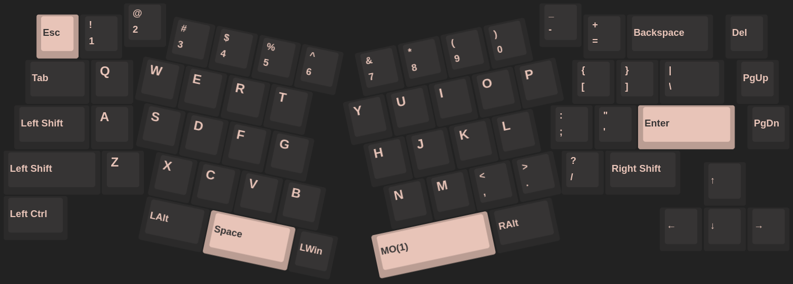
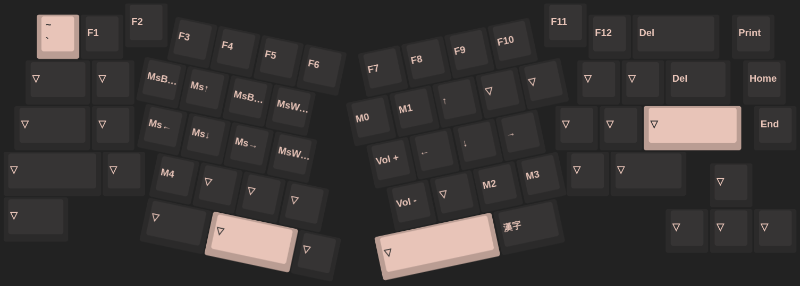

# Hardware

## Desktop

None

## Laptop

|    name | model                                                                                                                 |
| ------: | :-------------------------------------------------------------------------------------------------------------------- |
| Machine | secondhand [Lenovo IdeaPad Slim5 14ITL 5D M16 (IdeaPad 5 14ITL05-82FE)](https://prod.danawa.com/info/?pcode=12875984) |
|     CPU | intel i5-1135G7                                                                                                       |
|     GPU | Nvidia GeForce MX450 (TU117M)                                                                                         |
|     RAM | 16GB                                                                                                                  |
|     SSD | a single secondhand 500GB [Samsung 980 NVMe SSD](https://semiconductor.samsung.com/consumer-storage/internal-ssd/980) |

## Partitions

- total size: 500,107,862,016 bytes (465.8 GiB, 500.1 GB)

| format | size in bytes               | mount location | purpose            |
| -----: | :-------------------------- | :------------: | :----------------- |
|  FAT32 | 524,288,000 (500MiB)        |     /boot      | boot loader (GRUB) |
|   ext4 | 112,491,233,280 (104.8 GiB) |       /        | Linux installation |
|   ext4 | 387,091,267,584 (360.5GiB)  |   /home/pomp   | User data          |

## Peripherals

  
Old peripherals

| peripheral | model                                                                                                                                                                                                        | using since |
| ---------: | :----------------------------------------------------------------------------------------------------------------------------------------------------------------------------------------------------------- | :---------: |
|      Mouse | [Logitech G402 Hyperion fury](https://www.logitechg.com/en-eu/products/gaming-mice/g402-hyperion-fury-fps-gaming-mouse.html) I got from a [giveaway event](https://blog.naver.com/yjcomicsblog/221432692995) |      ?      |
|  Headphone | [NOX NX-2](https://www.e-nox.co.kr/theme/s007/index/product_view01.php?wr_id=16)                                                                                                                             |      ?      |

 

|     peripheral | model                                                                                                                  | using since  |
| -------------: | :--------------------------------------------------------------------------------------------------------------------- | :----------: |
|          Mouse | secondhand [Razer Viper Ultimate](https://www.razer.com/gaming-mice/razer-viper-ultimate)                              | Aug 23, 2022 |
|       Mousepad | [MAXTILL X5](https://prod.danawa.com/info/?pcode=6995089) (847x446mm)                                                  | Jul 4, 2023  |
|      Headphone | secondhand [Arctis Nova Pro Wireless](https://steelseries.com/gaming-headsets/arctis-nova-pro-wireless-pc-playstation) | Dec 29, 2023 |
|  Laptop Cooler | [ABKO NCORE NC500](http://ncore.co.kr/shop/product_item.php?ItId=2586312930)                                           |      ?       |
|       Keyboard | custom YMDK wings                                                                                                      | Aug 13, 2022 |
| Drawing tablet | secondhand [wacom CTL-472 (one by wacom)](https://www.wacom.com/en-us/products/pen-tablets/one-by-wacom)               | May 8, 2022  |
|        Monitor | secondhand [DELL Alienware AW2521HF](https://www.rtings.com/monitor/reviews/dell/alienware-aw2521hf)                   | Feb 24, 2023 |
|     Microphone | secondhand [Razer Seiren Mini](https://www.razer.com/streaming-microphones/razer-seiren-mini)                          | Aug 25, 2022 |

### Keyboard

- Parts & Accessories:
  - [Case + PCB + Stabilizers + Cable](https://ko.aliexpress.com/item/1005003330613995.html) (white)
  - [walnut wrist rest](https://ko.aliexpress.com/item/1005003629440348.html)
  - [foam](https://ko.aliexpress.com/item/1005004451001013.html) (PCB & Bottom Foam)
  - [Switches](https://www.aliexpress.com/item/1005003891937604.html) (Outemu silent peach)
  - [Switch Opener](https://smartstore.naver.com/ownkeeb/products/6804912949)
  - [Switch Film](https://www.aliexpress.com/item/1005002885279946.html) (HTV+PC 0.18mm)
  - [Lube](https://www.aliexpress.com/item/1005002297786498.html) (GPL205 G0 7.6g)
  - [Keycaps](https://www.aliexpress.com/item/1005003834670594.html) (GMK Geoma w/ Korean subs)
- Mods:
  - no-stabilizer

### Keymap

- [json VIA configuration](./wings_hotswap.json)
- Layer 0
  
- Layer 1
  
